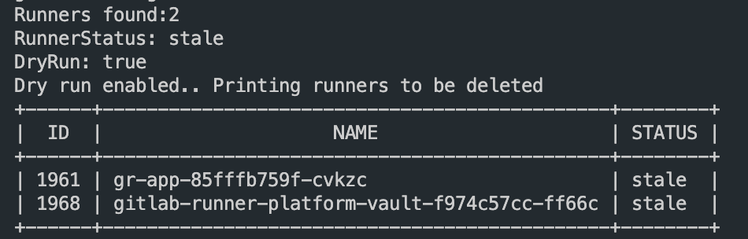

# How the Runner cleaner works

The runner cleaner queries the GitLab API for all the runners in the organization with the given status and then deletes them.


# Required environment Variables

| Name                | Type     | Required | Default   | Description                                                                |
|---------------------|----------|----------|-----------|----------------------------------------------------------------------------|
| GITLAB_API_TOKEN                | String   | yes      |  <GITLAB_API_TOKEN>         | Which API key to use to authenticate against GitLab                   |
| GITLAB_BASE_URL                 | String   | yes      | <https://gitlab.com>          | GitLab base URL                                              |
| GITLAB_RUNNER_STATUS            | String   | yes      | stale      | The status of runners to return, one of: ***online, offline, stale, and never_contacted***   |
| DRY_RUN                         | Boolean  | no       | True      | Wether or not it runs in dry run and actually deletes runners.           |

# Usage
 
```bash
 make run

```
# Installing requirements for development

```bash
make init
```

# Screenshot  of the runner cleaner in action
